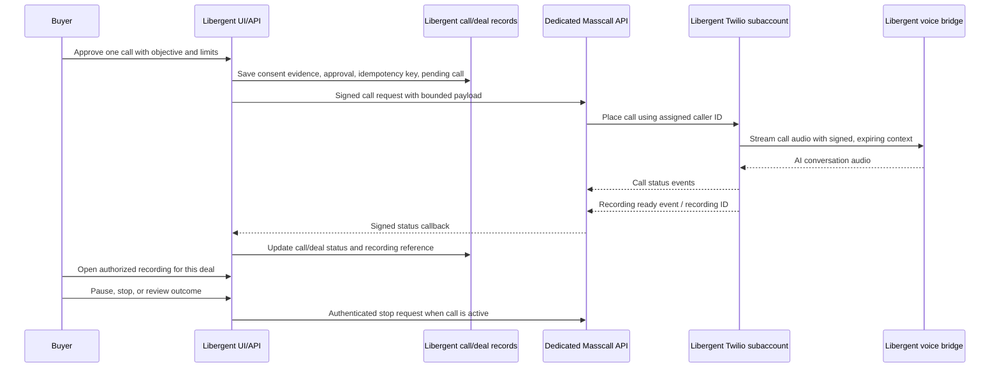

# Masscall calling infrastructure for Libergent

Updated: 2026-09-30

## Recommendation

Reuse Masscall's voice engine and operating knowledge as a service provider to Libergent. Keep the products and businesses distinct. For the first pilot, run a dedicated Libergent calling instance from the Masscall codebase, with separate provider accounts/configuration and a narrow server-to-server API. Do not connect Libergent to Masscall's owner dashboard or expose its admin token.

The first milestone should place one buyer-approved, bounded, recorded call tied to a Libergent deal, then return reliable status and recording access to that deal. Recording is a product requirement for the deal experience. Before a call starts, disclose recording and capture the required consent/authorization; define retention, access, and deletion. Masscall currently records live dashboard calls, but it has no automatic retention policy. The integration must keep recording per-call configurable and attach each recording to the correct Libergent deal.

## Current state

- Masscall has a Twilio calling endpoint, signed short-lived call context, a persistent WebSocket audio bridge, AI disclosure, call end control, and local mocked-provider tests. Its active call center is a single owner workspace. Calls and numbers use one configured Twilio account, and browser-local storage holds number identities.
- Masscall does not yet provide per-customer subaccounts, metered usage, durable tenant-scoped call ownership, or automatic retention. Real phone interoperability has not been tested according to its README.
- Libergent has a call-job gate in `src/call-pipeline.js` and an outreach brief in `src/outreach.js`, but no production call provider integration. The deals workflow and its data remain Libergent-owned.
- The existing call-job gate requires a Romanian destination and consent plus approval. The existing outreach brief expects recipient consent evidence. This needs careful definition: the buyer authorizes the agent to act, and the person being called must be contacted through an allowed channel and handled according to the applicable consent and opt-out rules.

## Separation boundary

| Area | Libergent owns | Masscall provides |
| --- | --- | --- |
| Customer account, Premium entitlement, selected listing, deal brief, approval, limits, pause/stop, and buyer history | Yes | No access except the minimum call payload needed to execute |
| Call execution, telephony adapter, real-time audio bridge, and AI session orchestration | Calls the service and owns the customer-facing workflow | Yes |
| Provider configuration | Libergent-specific service credentials and budgets | Dedicated Twilio subaccount/number, bridge secret, and OpenAI project or key for Libergent calls |
| Call status, recording, and outcomes | Durable Libergent deal/call records; buyer UI and authorized playback | Provider events, recording IDs/readiness, and execution IDs, returned through authenticated callbacks or status reads |
| Billing | Libergent subscription and customer usage policy | Masscall's internal service cost/charge to Libergent, accounted for separately from Masscall customer revenue |

Share source code and, where practical, the same physical host. Give the Libergent process its own environment, process identity, port, secrets, queue/rate limits, logs, and storage namespace. The current Masscall bridge reads one Twilio account from process environment, so the lowest-risk first deployment is a second bridge/API instance rather than adding broad multi-tenant account routing to the existing instance.

Keep Libergent customer/deal data in Libergent storage. Send the calling service only the destination, assigned caller ID, concise approved objective, required facts, and opaque Libergent call/deal references. Do not send Supabase credentials, session tokens, customer account tokens, payment details, or unrelated conversation history.

## Proposed request flow

The diagram describes the target flow; Masscall does not currently expose this service API or status callback for Libergent.

## Phases

### 0. Confirm the operating boundary

Before live calls, record the internal commercial and operational arrangement between the two businesses:

- Which business pays Twilio, model, number rental, recording, hosting, and support costs; how Libergent prices those costs to its customers.
- Which business controls the call purpose and scripts, handles data requests/deletion, and responds to incidents. Define the recording's purpose, authorized viewers, retention period, deletion process, and incident handling before the first pilot. Transcripts remain out of scope unless separately approved.
- The permitted destination countries, calling hours, marketplace/channel rules, contact sources, opt-out handling, and per-user/per-day spend and call limits. Buyer authorization, the allowed basis and source for initiating contact, and recording disclosure/consent are separate checks; requiring the seller to pre-consent before any initial call may not match the intended workflow.
- Which Masscall components may be shared and who can access logs or operational controls.

These are business and policy decisions; a technical consent flag alone does not settle them.

### 1. Isolate the Libergent runtime

- Create a dedicated Twilio subaccount and assign a Libergent caller ID. Do not use Masscall's owner account or numbers for Libergent customer calls.
- Create a separate OpenAI project/key and a unique bridge signing secret. Use separate Redis/database namespaces if the service stores any state; the first version should store the authoritative deal and call state in Libergent.
- Run a second Masscall API/bridge instance with its own service configuration. Restrict network access so only Libergent's Worker can invoke the private API; keep `/dashboard` and the Masscall admin token inaccessible to Libergent users.
- Add a Libergent-specific service identity. Do not let callers choose a Twilio account, arbitrary caller ID, model secret, or unbounded prompt.

**Exit check:** a config review shows no shared Twilio account SID, provider key, bridge secret, customer data store, or admin token between the two runtimes.

### 2. Add a narrow Masscall call API

Add a private API designed for one authorized call at a time:

- `POST /v1/calls`: accept a unique idempotency key, opaque Libergent call ID, destination, configured caller ID, bounded objective/context, language, required recording mode, and references for buyer authorization, recording disclosure/consent, and the permitted contact source/channel. Validate the caller ID against the dedicated Twilio account and enforce destination, duration, concurrency, and spend limits server-side.
- `GET /v1/calls/{providerCallId}`: return normalized state, timestamps, duration, and a safe error code. Never return provider credentials or recording media through this service API.
- `POST /v1/calls/{providerCallId}/stop`: terminate an active call, idempotently.
- A signed, replay-resistant callback for initiated/ringing/answered/completed/failed plus provider call ID, timestamps, duration, a bounded failure code, and recording ID/readiness when available. Add periodic reconciliation so lost callbacks do not leave Libergent calls or recording status stuck.
- Require request authentication with rotation, timestamp/nonce validation, strict schema and size checks, rate limits, and request logging that redacts phone numbers and prompts. Keep a stable request ID across retries to prevent duplicate dialing.
- Provide recording metadata and an authenticated retrieval path scoped to the owning Libergent deal. The provider recording URL must never be exposed as a public link; use an authenticated proxy or short-lived access URL after verifying deal ownership.

Return a provider call ID only after Twilio accepts the call. Treat an API timeout after submission as an unknown state and reconcile by idempotency key before retrying; never blindly place a second call.

### 3. Connect Libergent's buyer workflow

- Add a durable `deal_calls` record in Libergent keyed to the authenticated user and deal. Store a random internal ID, provider ID, status, approval and recording consent evidence references/timestamps, idempotency key, creation/completion time, duration, failure code, recording ID/readiness, and cost fields when available.
- Add an authenticated Premium endpoint that verifies deal ownership, active entitlement, active/unpaused deal, supported contact route, valid destination, approved objective, and configured call limits before submitting.
- Show the exact call purpose, recipient, caller identity, what facts the agent may use, recording notice, and the stop behavior before buyer approval. Store buyer approval and recording consent/disclosure evidence with the version/hash of the submitted brief.
- Provide live/finished/failed status, stop, recording playback, and outcome controls in the Finder/chat deal view. Call state and recording readiness should appear as separate states; recording availability must not be mistaken for live-call status. A completed call must not automatically mean seller agreement or purchase; record seller response, offer, buyer acceptance, and completion as separate events.
- Extend `src/call-pipeline.js` so approval is tied to a specific deal and expires. Keep buyer authorization, permitted contact source/channel, recording disclosure/consent, and opt-out state as distinct fields instead of one `consented` boolean. Do not assume that one buyer checkbox establishes permission for every destination or channel.

### 4. Prove it with a controlled pilot

Progress through these checks in order:

1. Local contract tests for authentication, validation, duplicate idempotency key, timeout/reconciliation, stop behavior, call and recording callbacks, recording access ownership, retention/deletion, and failure handling. Mock Twilio and model calls.
2. Deployed non-calling health checks confirm API-to-bridge authentication, correct subaccount configuration, service isolation, and callback signature verification.
3. One explicitly designated internal/test recipient, with the buyer workflow and required disclosures visible. Confirm ringing, answer, audio, hangup, call callbacks, recording completion/playback/deletion, history, stop, and provider billing records.
4. One invited buyer and seller only after channel/source permission, consent, number ownership, support process, budget cap, and retention behavior have been reviewed.
5. Expand the pilot only after measured call completion, failure, opt-out, cost, and buyer-confirmed outcomes are reliable.

No live calls or production configuration changes are part of this plan.

## First milestone acceptance criteria

- A signed-in Premium buyer can authorize one call for a deal they own, with a valid destination and bounded objective.
- Repeated requests with the same idempotency key create at most one provider call.
- The buyer can see pending, active, completed, and failed states; can stop an active call; and sees stale/unknown state clearly if callback delivery fails.
- Call data and provider identifiers cannot be read across Libergent users. Libergent users cannot use Masscall's owner APIs.
- Libergent calls use their assigned caller ID, isolated provider credentials, and configured call/time/spend limits.
- Every pilot call is recorded after the required disclosure/consent gate. Its recording is attached to the correct deal, accessible only to authorized users, and deleted according to the chosen retention period.
- A test run accounts for provider charges and does not create a false deal-agreed or purchase-completed state.

## Scale work after the pilot

- Meter actual Twilio, model, number, storage, and support usage by Libergent account and reconcile it to provider invoices.
- Add tenant-aware number provisioning and regulatory workflows only if Libergent needs to resell or assign numbers to its own customers.
- Add and monitor the retention/deletion job and access audit for recordings and any transcripts. Keep media in provider storage or a separately controlled store with short-lived access.
- Decide whether to maintain two deployable configurations from one Masscall codebase or extract a versioned voice service. Avoid a generalized multitenant Masscall rewrite until the single Libergent path proves useful.
- Add operator alerting, failed-call review, abuse controls, disaster recovery, and a clear customer support handoff.

## Main risks and mitigations

| Risk | Mitigation |
| --- | --- |
| Masscall's owner API can control numbers and calls for an entire account | New narrow service API and isolated Twilio subaccount; never share the dashboard token |
| Retry after a network timeout places duplicate calls | Durable idempotency in both services and provider reconciliation before retry |
| Buyer authorization is mistaken for permission to call a seller | Check the allowed contact source/channel and applicable contact rules separately; keep unsupported contacts as buyer handoff and honor opt-outs |
| Recording is exposed to the wrong buyer or kept indefinitely | Verify deal ownership for every playback request; set recording disclosure/consent, retention, deletion, and access audit before pilot |
| Call succeeds but Libergent never receives its status or recording readiness | Signed callbacks plus reconciliation and visible unknown state for call status and recording readiness |
| Shared infrastructure exposes one business to the other's data or outages | Separate processes, secrets, queues, provider accounts, logs, limits, and storage; document the remaining shared-host failure domain |
| Agent makes a commitment outside the deal brief | Restrict the objective and facts; require buyer approval for offer changes, agreement, payment, or personal data; stop/escalate on uncertainty |

## Related implementation notes

- Masscall: `/Users/vicorico/code/masscall/README.md`, `api/telephony.js`, `bridge/server.js`, `lib/call-context.js`, and `lib/studio.js`.
- Libergent: `src/call-pipeline.js`, `src/outreach.js`, `docs/premium-deal-agent.md`, and `docs/premium-alerts-todo.md`.
